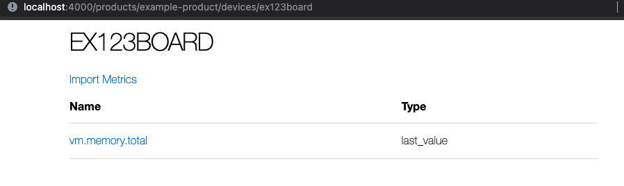
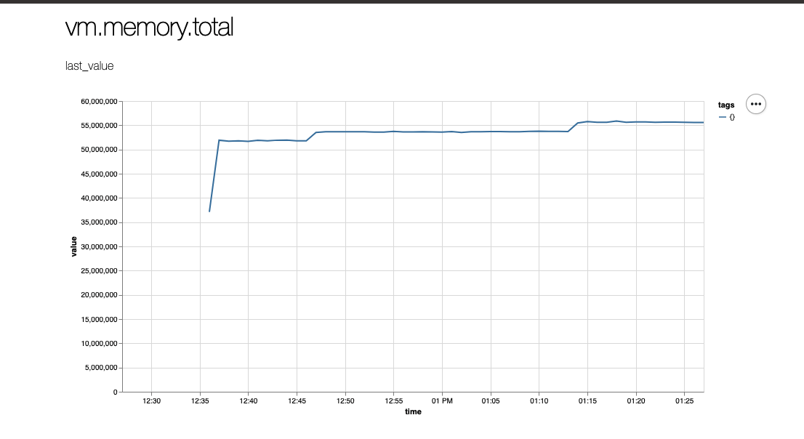

# Using Nexus locally

For either development and testing you might want to run Nexus locally.

## Nexus system requirements

1. Elixir 1.12+
1. Erlang OTP 24+
1. Phoenix 1.6+
1. Docker or an instance of Timescale DB

If you are using docker for your Timescale DB in the project directory run:

## Up and running

### Dependencies

```
mix deps.get
```

### Database setup

```
docker-compose up -d
```

Otherwise you will need to configure the Timescale DB in the the config files
for your environment.

After you database is running and configured correctly (if you're using docker
the configuration is already setup) you should run:

```
mix ecto.setup
```

This will create the database, run the migrations, and run seeds.

After the seeds you should see a message about how to login as the admin user:

```
======================= FINISH SET UP INSTRUCTION BELOW =====================

#########################
## Login as admin user ##
#########################

Run the phoenix server:

iex -S mix phx.server

And navigate to

http://localhost:4000/users/login/<some_token>
```

Start the server and follow that link and you will be authenticated as the
admin user.

If you need to authenticate again you can go to `http://localhost:400/` and
enter the email of the user you want to authenticate as. After you 
successfully do that navigate to `http://localhost:4000/dev/mailbox` and the first
E-Mail should contain the authentication link.

## Get metrics and conducting uploads

The seeds created an example project and a dummy device.

The way Nexus currently works is you have to configure which metrics are allowed
to be reported for your devices in your projects, but for your example product
the `vm.memory.total` metric is already configured.

### From the ExampleDevice

Nexus provides an example device project in the `example_device` directory. This
device has `Mobius` setup to report the `vm.memory.total` metric. To run this
project:

```
cd example_device
mix deps.get
iex -S mix
```

After starting the example device you inspect what current state of the metrics
by running `Mobius.info/0`

```elixir
iex> Mobius.info
Metric Name: vm.memory.total
Tags: %{}
last_value: 37103112
```

Go grab a coffee, tea, water, snack or whatever you like to do during a 10
minute break. This will give the device some time to collect metrics.

If you want to continue tracking metrics over time but need to stop the example
device, you can run `ExampleDevice.shutdown/0`. Ths will gracefully shutdown the
device and save the metrics in your your system's temp directory so they can be
restored on future runs. This is a good way to accumulate metrics over time.

### Exporting data from example device

Skip to the next section if you're trying to pull data from a Nerves device.

In IEx session for the example device run:

```
ExampleDevice.export()
```

This will export a file in your system's temp director that follows this
pattern:

```
YYYYMMDDHHMMSS-metrics.mbf
```

This will return `{:ok, path_to_generated_file}`.

### Exporting from a running Nerves device

If you have a Nerves device that has Mobius running (at least `v0.4.0`) you can
export the data via ssh, `Mobius.Exports.mbf/1`, and `sftp`

First, ssh to the device and generate the export.

```
ssh my-device
iex> Mobius.Exports.mbf(out_dir: "/tmp")
{:ok, file_path}
iex> exit
```

Tip: Copy the file path to your clipboard to use for the step

Next, use sftp to retrieve the file

```
sftp my-device
get file_path
exit
```

Tip: If you copied the file path to your clipboard your can paste it into the
console for the `get` command.

#### Uploading data

Once you have access to the `.mbf` file you want to upload navigate the device
metric upload [screen](http://localhost:4000/products/example-product/devices/ex123board).



Click on the `"Import Metrics"` link which will take you to the device metric
upload screen


Choose your file and press upload. If successful you be sent back to the device
screen with a flash message saying the import was successful.


Click on the metric name and behold the graph!



The graph shows the average reading over a minute for the last hour.

